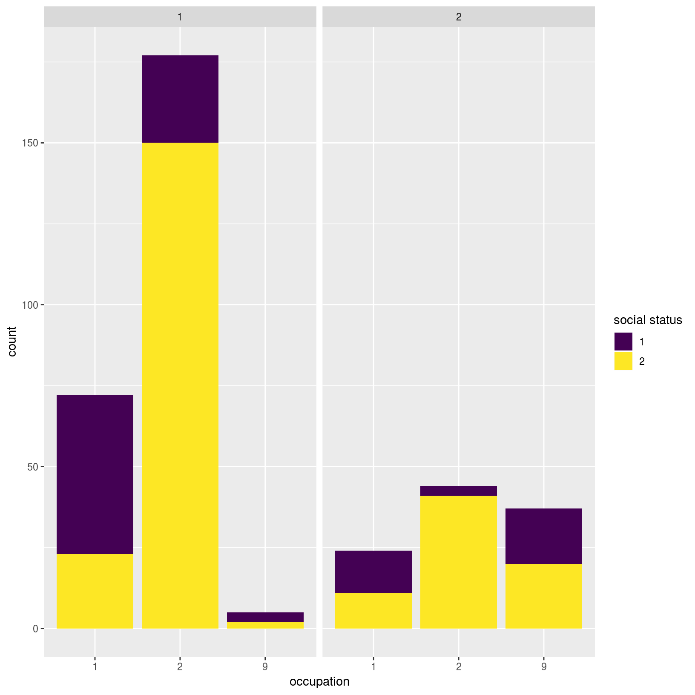

---
# Please do not edit this file directly; it is auto generated.
# Instead, please edit 17-example-dataset.md in _episodes_rmd/
title: "Mortality and survival in Game of Thrones"
teaching: 15
exercises: 40
questions:
- "How can I perform preliminary data quality visualisations?"
objectives:
- Learn how to undertake simple dataset review and visualitions
- Perform suvival analyses
keypoints:
- "Load data into R."
- "Perform basic data visualisations using ggplot2"
source: Rmd
---

Let's start by downnloading Game of Thrones characters' mortality data, that was published [here](https://figshare.com/articles/Game_of_Thrones_mortality_and_survival_dataset/8259680?mc_cid=6ee60dc1ef&mc_eid=f10fe3b3f2). Please save the following two files using `File - Save As` dialog in your browser.

1. Original [characters data](https://raw.githubusercontent.com/lauzikaite/r-novice-gapminder/gh-pages/_episodes_rmd/data/character_data_S01-S08.csv)
2. Additional [data encoding](https://raw.githubusercontent.com/lauzikaite/r-novice-gapminder/gh-pages/_episodes_rmd/data/encoding.csv) table

> ## Challenge 1
>
> Save all three files your `data/` directory and change the working directory to it.
> Now read the `data/character_data_S01-S08.csv` and `encoding.csv` files into R.
>
> > ## Solution to Challenge 1
> >
> > 
> > ~~~
> > setwd('path/to/data')
> > got_dat <- read.csv(file = "character_data_S01-S08.csv", header = TRUE, stringsAsFactors = FALSE)
> > meta <- read.csv(file = "encoding.csv", header = TRUE, stringsAsFactors = FALSE)
> > ~~~
> > {: .language-r}
> {: .solution}
{: .challenge}

Once that data is loaded, let's evualuate its quality.

> ## Challenge 2
>
> Does the table with GoT characters's mortality data look correct? Are there any missing entries? 
>
> > ## Solution to Challenge 2
> > Note that there are many ways to do it.
> > 
> > ~~~
> > ## make a summary for each column 
> > summary(got_dat)
> > ~~~
> > {: .language-r}
> > 
> > 
> > 
> > ~~~
> >        id            name                sex           religion    
> >  Min.   :100.0   Length:359         Min.   :1.000   Min.   :1.000  
> >  1st Qu.:189.5   Class :character   1st Qu.:1.000   1st Qu.:4.000  
> >  Median :279.0   Mode  :character   Median :1.000   Median :9.000  
> >  Mean   :279.0                      Mean   :1.292   Mean   :7.042  
> >  3rd Qu.:368.5                      3rd Qu.:2.000   3rd Qu.:9.000  
> >  Max.   :458.0                      Max.   :2.000   Max.   :9.000  
> >                                                                    
> >    occupation    social_status   allegiance_last allegiance_switched
> >  Min.   :1.000   Min.   :1.000   Min.   :1.000   Min.   :1.000      
> >  1st Qu.:1.000   1st Qu.:1.000   1st Qu.:3.000   1st Qu.:1.000      
> >  Median :2.000   Median :2.000   Median :7.000   Median :1.000      
> >  Mean   :2.552   Mean   :1.688   Mean   :5.588   Mean   :1.153      
> >  3rd Qu.:2.000   3rd Qu.:2.000   3rd Qu.:8.000   3rd Qu.:1.000      
> >  Max.   :9.000   Max.   :2.000   Max.   :9.000   Max.   :2.000      
> >                                                                     
> >   intro_season   intro_episode   intro_time_sec   intro_time_hrs 
> >  Min.   :1.000   Min.   : 1.00   Min.   :     1   Min.   : 0.00  
> >  1st Qu.:1.000   1st Qu.: 9.00   1st Qu.: 25348   1st Qu.: 7.04  
> >  Median :3.000   Median :26.00   Median : 77694   Median :21.58  
> >  Mean   :3.487   Mean   :29.07   Mean   : 87279   Mean   :24.24  
> >  3rd Qu.:5.000   3rd Qu.:49.00   3rd Qu.:146960   3rd Qu.:40.82  
> >  Max.   :8.000   Max.   :73.00   Max.   :229649   Max.   :63.79  
> >                                                                  
> >     dth_flag        dth_season     dth_episode     dth_time_sec   
> >  Min.   :0.0000   Min.   :1.000   Min.   : 1.00   Min.   :   342  
> >  1st Qu.:0.0000   1st Qu.:2.750   1st Qu.:22.25   1st Qu.: 67520  
> >  Median :1.0000   Median :5.000   Median :43.50   Median :131499  
> >  Mean   :0.5905   Mean   :4.571   Mean   :41.55   Mean   :126015  
> >  3rd Qu.:1.0000   3rd Qu.:6.000   3rd Qu.:59.00   3rd Qu.:178775  
> >  Max.   :1.0000   Max.   :8.000   Max.   :73.00   Max.   :226284  
> >                   NA's   :147     NA's   :147     NA's   :147     
> >   dth_time_hrs   censor_time_sec  censor_time_hrs   exp_season   
> >  Min.   : 0.10   Min.   :   342   Min.   : 0.10   Min.   :1.000  
> >  1st Qu.:18.76   1st Qu.:115072   1st Qu.:31.96   1st Qu.:1.000  
> >  Median :36.53   Median :190484   Median :52.91   Median :3.000  
> >  Mean   :35.00   Mean   :168922   Mean   :46.92   Mean   :3.487  
> >  3rd Qu.:49.66   3rd Qu.:230800   3rd Qu.:64.11   3rd Qu.:6.000  
> >  Max.   :62.86   Max.   :230800   Max.   :64.11   Max.   :8.000  
> >  NA's   :147                                                     
> >   exp_episode     exp_time_sec     exp_time_hrs   featured_episode_count
> >  Min.   : 1.00   Min.   :     8   Min.   : 0.00   Min.   : 1.000        
> >  1st Qu.: 5.00   1st Qu.: 14496   1st Qu.: 4.03   1st Qu.: 1.000        
> >  Median :20.00   Median : 66551   Median :18.49   Median : 3.000        
> >  Mean   :26.35   Mean   : 81644   Mean   :22.68   Mean   : 7.805        
> >  3rd Qu.:45.00   3rd Qu.:144592   3rd Qu.:40.16   3rd Qu.: 8.000        
> >  Max.   :73.00   Max.   :230347   Max.   :63.99   Max.   :67.000        
> >                                                                         
> >    prominence     dth_description    icd10_dx_code      icd10_dx_text     
> >  Min.   :0.1111   Length:359         Length:359         Length:359        
> >  1st Qu.:0.3333   Class :character   Class :character   Class :character  
> >  Median :0.8750   Mode  :character   Mode  :character   Mode  :character  
> >  Mean   :1.1292                                                           
> >  3rd Qu.:1.1716                                                           
> >  Max.   :7.3425                                                           
> >                                                                           
> >  icd10_cause_code   icd10_cause_text   icd10_place_code  
> >  Length:359         Length:359         Length:359        
> >  Class :character   Class :character   Class :character  
> >  Mode  :character   Mode  :character   Mode  :character  
> >                                                          
> >                                                          
> >                                                          
> >                                                          
> >  icd10_place_text    top_location    geo_location    time_of_day   
> >  Length:359         Min.   :1.000   Min.   :1.000   Min.   :1.000  
> >  Class :character   1st Qu.:1.000   1st Qu.:1.000   1st Qu.:1.000  
> >  Mode  :character   Median :2.000   Median :1.000   Median :1.000  
> >                     Mean   :2.377   Mean   :1.175   Mean   :2.509  
> >                     3rd Qu.:2.000   3rd Qu.:1.000   3rd Qu.:2.000  
> >                     Max.   :9.000   Max.   :2.000   Max.   :9.000  
> >                     NA's   :147     NA's   :147     NA's   :147    
> >     X             X.1            X.2            X.3         
> >  Mode:logical   Mode:logical   Mode:logical   Mode:logical  
> >  NA's:359       NA's:359       NA's:359       NA's:359      
> >                                                             
> >                                                             
> >                                                             
> >                                                             
> >                                                             
> >    X.4            X.5         
> >  Mode:logical   Mode:logical  
> >  NA's:359       NA's:359      
> >                               
> >                               
> >                               
> >                               
> >                               
> > ~~~
> > {: .output}
> >
> > The last five columns have no entries at all and should be removed to not interfer with statistical analyses.
> > 
> > ~~~
> > ## remove columns that only contain NAs as entries
> > got <- got_dat[ , which(!apply(got_dat, 2, function(x) all(is.na(x))))]
> > ~~~
> > {: .language-r}
> {: .solution}
{: .challenge}

## Graphical data exploration

To make graphical data visulisations, we will be using `ggplot`  library.

~~~
library(ggplot2)
~~~
{: .language-r}

First, we will make plots to check the distribution of different variables:

**Categorical**:

* sex
* religion
* occupation
* social_status
* allegiance
* ...

Type of **occupation** was categorised as “silk collar” (e.g. clergy, merchants, politicians, and rulers) or “boiled leather collar” (e.g. warriors, farmers, and other occupations relying heavily on manual work). 
Type of **social status** was categorised as “highborn” (lords, ladies, or legitimate offspring) or “lowborn” (all other characters).

Because some characters switched **allegiance** during the show, both their last known allegiance and whether or not they switched allegiance during the show were recorded.

**Continuous**:

* exp_time_sec, survival time of character
* intro_time_sec, cumulative net running time when character first appeared
* dth_episode, number of the episode in which character died
* prominence
* ...

A proxy measure for how prominently a character featured in the show was provided in the data. This **prominence** score was calculated by taking the number of episodes that a character appeared in and dividing that by the number of total episodes that the character could have appeared in (i.e. the number of episodes occurring from the character first being introduced until the point of death or censoring). This ratio was then multiplied by the number of seasons that the character had featured in.

> ## Quick question
>
> What every other variable in the dataset is: categorical or continuous?
{: .callout}

## Distribution

To begin with, let's compare three categorical variables at a time, e.g. occupation vs sex vs social status.

~~~
ggplot(got) +
  geom_histogram(aes(x = factor(occupation), fill = factor(social_status)), stat = "count") +
  facet_wrap(~sex) +
  scale_x_discrete(name = "occupation") +
  scale_fill_viridis_d(name = "social status")
~~~
{: .language-r}

~~~
Warning: Ignoring unknown parameters: binwidth, bins, pad
~~~
{: .error}

