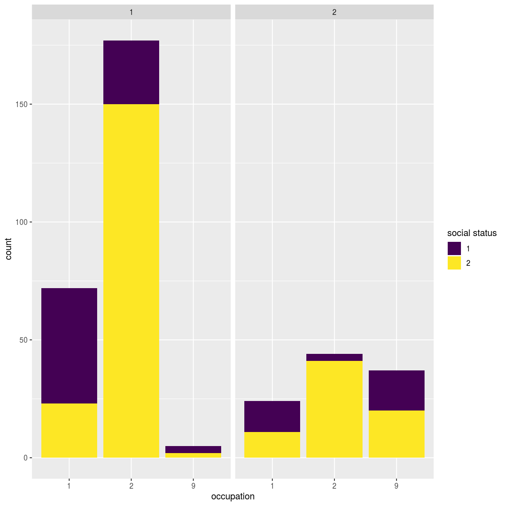
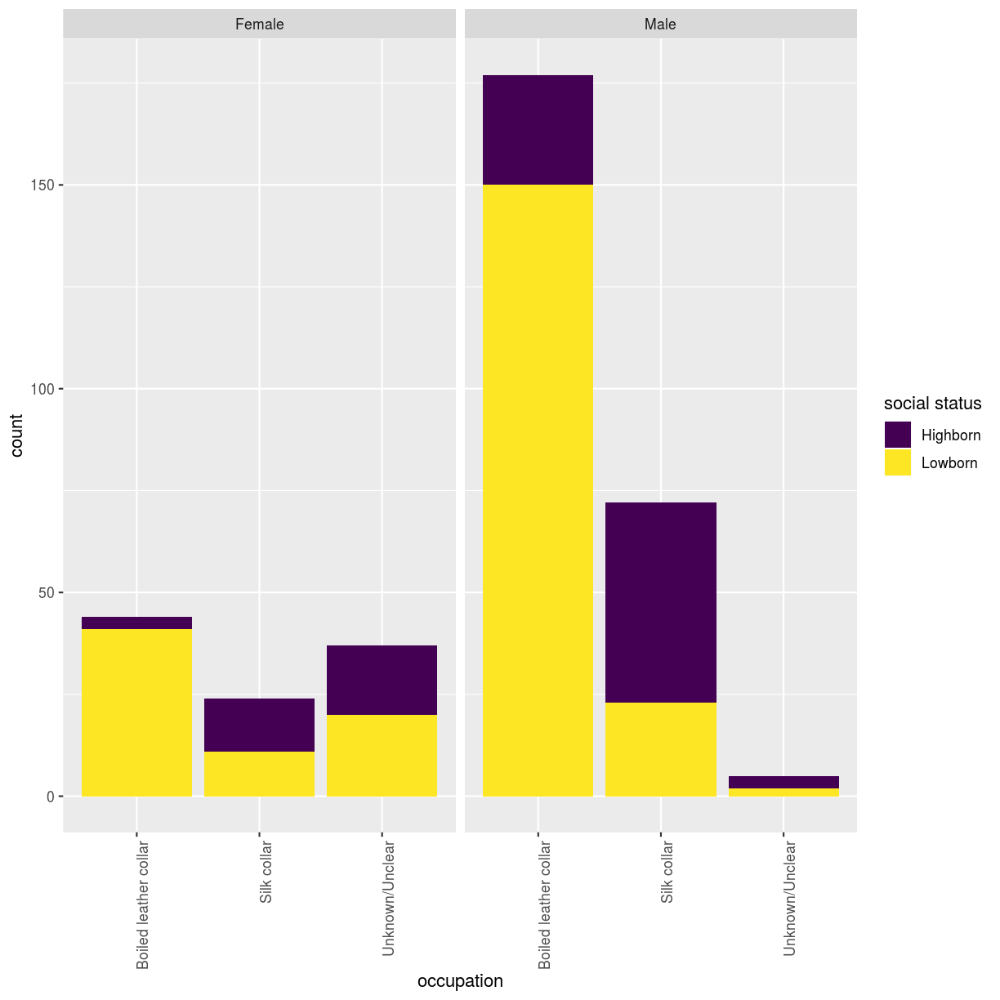
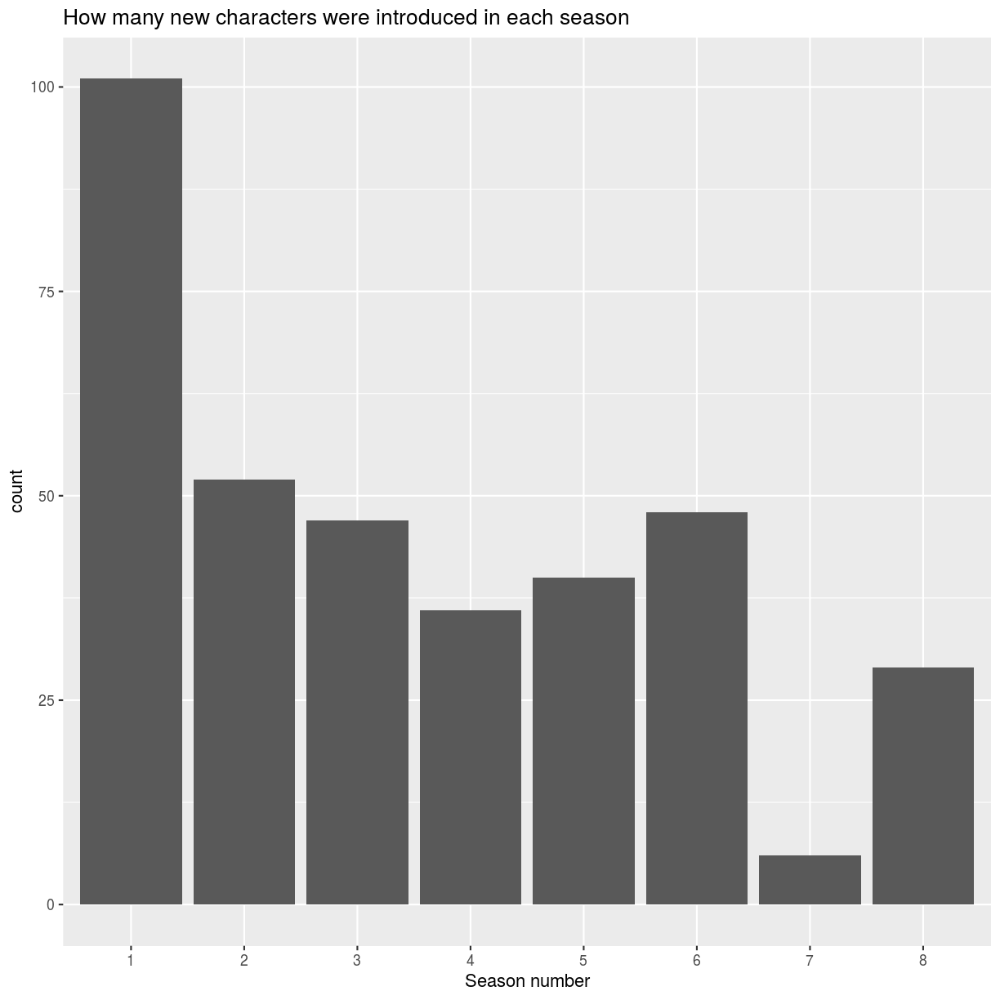
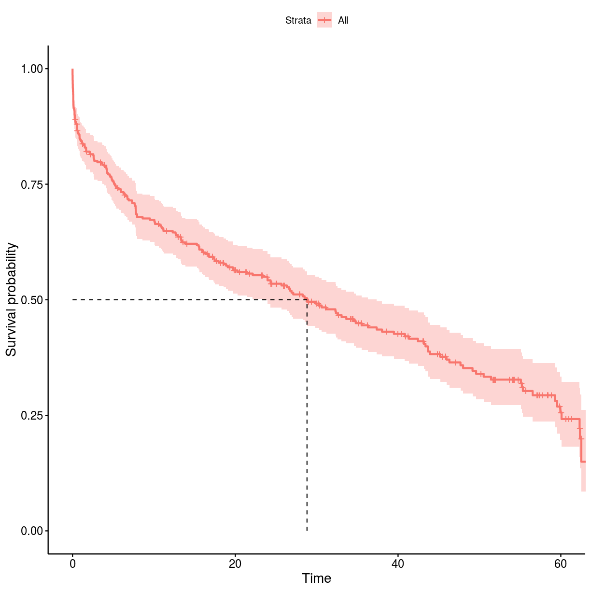
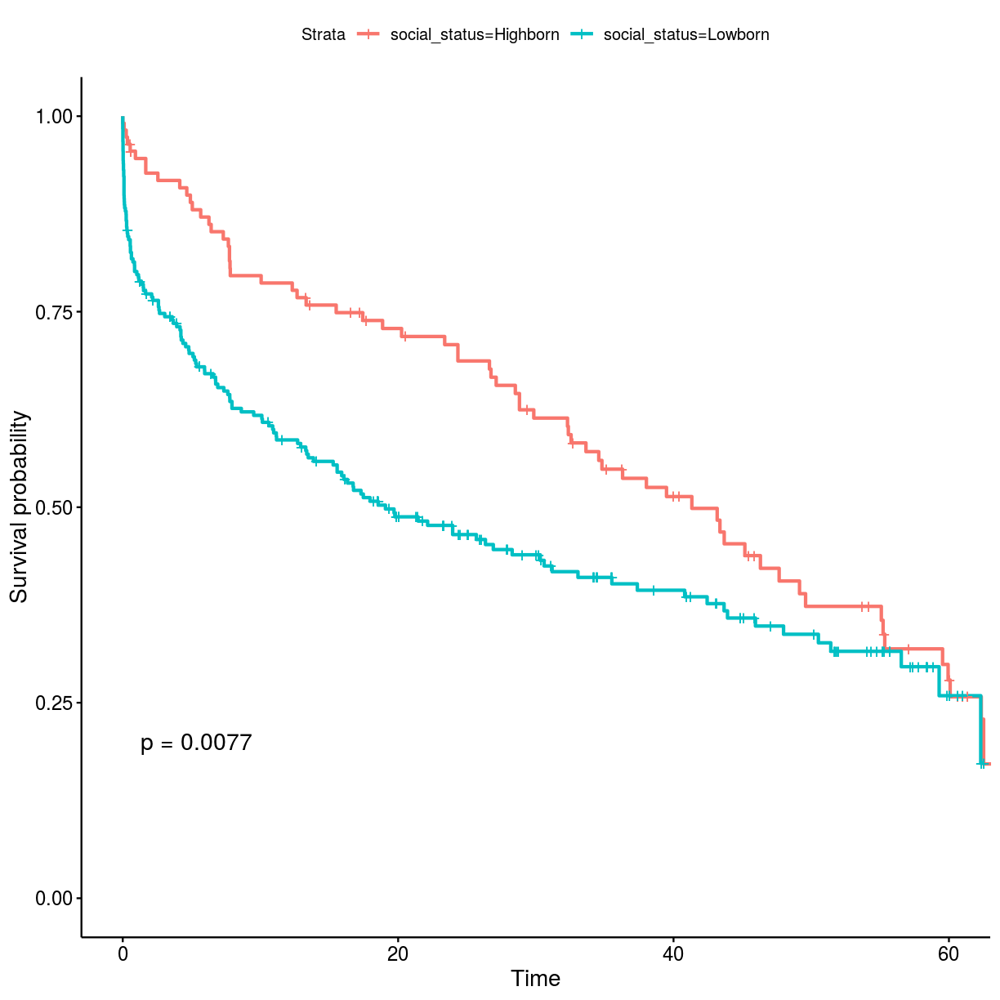
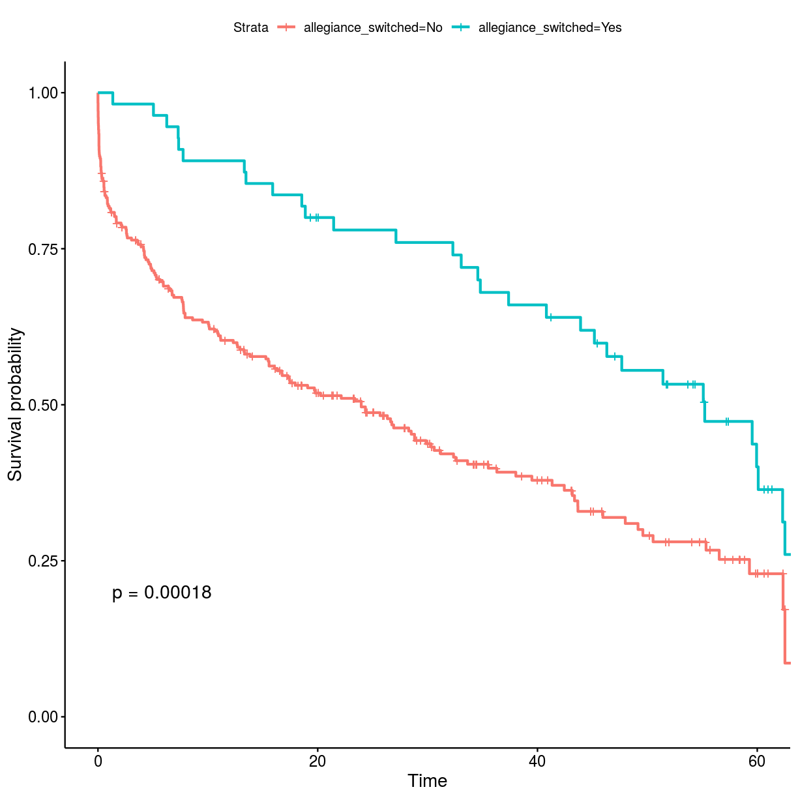
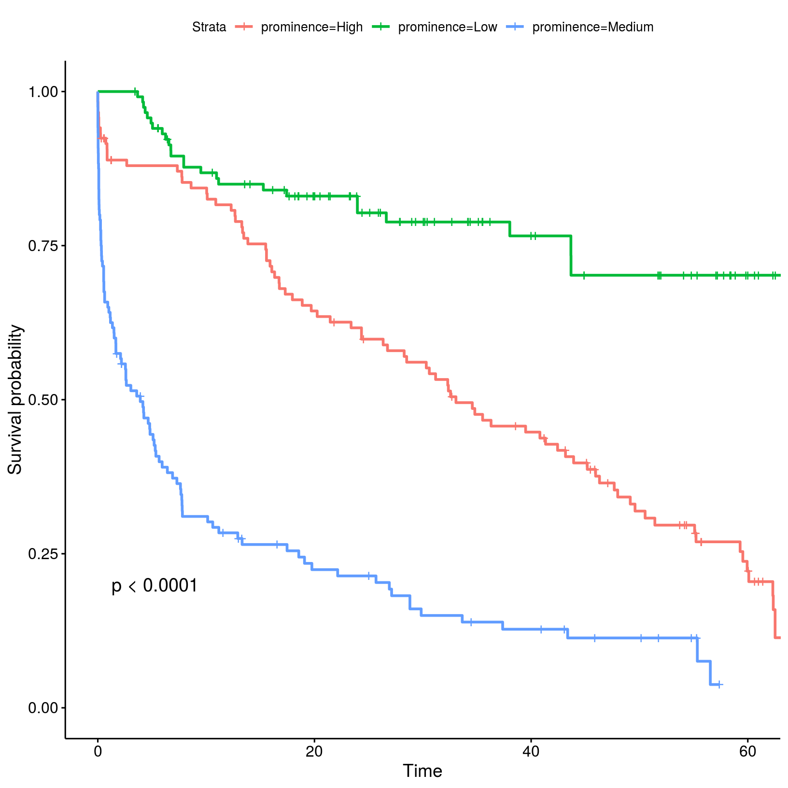
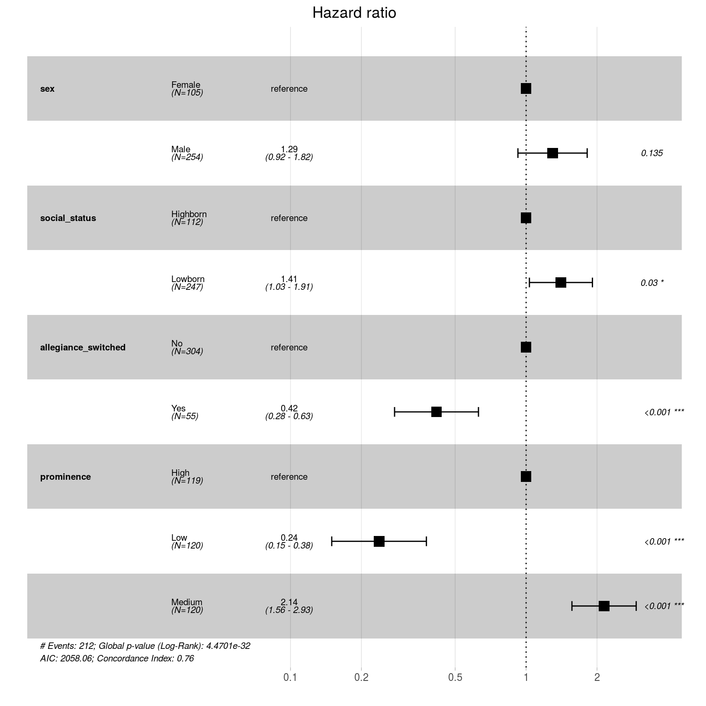

---
# Please do not edit this file directly; it is auto generated.
# Instead, please edit 17-example-dataset.md in _episodes_rmd/
title: "Mortality and survival in Game of Thrones"
teaching: 15
exercises: 40
keypoints:
- Load data into R.
- Practice using **base R** and **Tidyverse**.
- Perform basic data visualisations using `ggplot2` package.
- Perform survival analyses using `survival` and `survminer` packages.
objectives:
- Explore GoT mortality dataset.
- Visualise GoT dataset graphically.
- Get to know the basics of suvival analyses.
questions:
- How can I perform basic graphical data visualisations?
- How can I perform survival analysis?
source: Rmd
---

Let's start by downloading Game of Thrones characters' mortality data, that was published [here](https://figshare.com/articles/Game_of_Thrones_mortality_and_survival_dataset/8259680?mc_cid=6ee60dc1ef&mc_eid=f10fe3b3f2). Please save the following two files using `File - Save As` dialog in your browser.

1. Original [characters data](https://raw.githubusercontent.com/lauzikaite/r-novice-gapminder/gh-pages/_episodes_rmd/data/character_data_S01-S08.csv)
2. Additional [data encoding](https://raw.githubusercontent.com/lauzikaite/r-novice-gapminder/gh-pages/_episodes_rmd/data/encoding.csv) table

In this episode, we will provide solutions based both on **base R** and **Tidyverse**. To begin with, we will only load the `dplyr` package, which we will use the most. Note that we will call some of the functions from other **Tidyverse** packages by `package_name::function_name` which is a common way of calling functions without loading the whole package.

~~~
library(dplyr)
~~~
{: .language-r}

~~~

Attaching package: 'dplyr'
~~~
{: .output}

~~~
The following objects are masked from 'package:stats':

    filter, lag
~~~
{: .output}

~~~
The following objects are masked from 'package:base':

    intersect, setdiff, setequal, union
~~~
{: .output}

> ## Challenge 1
>
> Save all three files your `data/` directory and change the working directory to it.
> Now read the `data/character_data_S01-S08.csv` and `data/encoding.csv` files into R.
>
> > ## Solution to Challenge 1
> >
> > 
> > ~~~
> > setwd('path/to/data')
> > got_dat <- read.csv(file = "character_data_S01-S08.csv", header = TRUE, stringsAsFactors = FALSE)
> > meta <- read.csv(file = "encoding.csv", header = TRUE, stringsAsFactors = FALSE)
> > ~~~
> > {: .language-r}
> {: .solution}
{: .challenge}

Once data is loaded into R, let's evaluate its quality.

> ## Challenge 2
>
> Does the table with GoT characters's mortality data look correct? Are there any missing entries? 
>
> > ## Solution to Challenge 2
> >
> > 
> > ~~~
> > ## make a summary for each column 
> > summary(got_dat)
> > ~~~
> > {: .language-r}
> > 
> > 
> > 
> > ~~~
> >        id            name                sex           religion    
> >  Min.   :100.0   Length:359         Min.   :1.000   Min.   :1.000  
> >  1st Qu.:189.5   Class :character   1st Qu.:1.000   1st Qu.:4.000  
> >  Median :279.0   Mode  :character   Median :1.000   Median :9.000  
> >  Mean   :279.0                      Mean   :1.292   Mean   :7.042  
> >  3rd Qu.:368.5                      3rd Qu.:2.000   3rd Qu.:9.000  
> >  Max.   :458.0                      Max.   :2.000   Max.   :9.000  
> >                                                                    
> >    occupation    social_status   allegiance_last allegiance_switched
> >  Min.   :1.000   Min.   :1.000   Min.   :1.000   Min.   :1.000      
> >  1st Qu.:1.000   1st Qu.:1.000   1st Qu.:3.000   1st Qu.:1.000      
> >  Median :2.000   Median :2.000   Median :7.000   Median :1.000      
> >  Mean   :2.552   Mean   :1.688   Mean   :5.588   Mean   :1.153      
> >  3rd Qu.:2.000   3rd Qu.:2.000   3rd Qu.:8.000   3rd Qu.:1.000      
> >  Max.   :9.000   Max.   :2.000   Max.   :9.000   Max.   :2.000      
> >                                                                     
> >   intro_season   intro_episode   intro_time_sec   intro_time_hrs 
> >  Min.   :1.000   Min.   : 1.00   Min.   :     1   Min.   : 0.00  
> >  1st Qu.:1.000   1st Qu.: 9.00   1st Qu.: 25348   1st Qu.: 7.04  
> >  Median :3.000   Median :26.00   Median : 77694   Median :21.58  
> >  Mean   :3.487   Mean   :29.07   Mean   : 87279   Mean   :24.24  
> >  3rd Qu.:5.000   3rd Qu.:49.00   3rd Qu.:146960   3rd Qu.:40.82  
> >  Max.   :8.000   Max.   :73.00   Max.   :229649   Max.   :63.79  
> >                                                                  
> >     dth_flag        dth_season     dth_episode     dth_time_sec   
> >  Min.   :0.0000   Min.   :1.000   Min.   : 1.00   Min.   :   342  
> >  1st Qu.:0.0000   1st Qu.:2.750   1st Qu.:22.25   1st Qu.: 67520  
> >  Median :1.0000   Median :5.000   Median :43.50   Median :131499  
> >  Mean   :0.5905   Mean   :4.571   Mean   :41.55   Mean   :126015  
> >  3rd Qu.:1.0000   3rd Qu.:6.000   3rd Qu.:59.00   3rd Qu.:178775  
> >  Max.   :1.0000   Max.   :8.000   Max.   :73.00   Max.   :226284  
> >                   NA's   :147     NA's   :147     NA's   :147     
> >   dth_time_hrs   censor_time_sec  censor_time_hrs   exp_season   
> >  Min.   : 0.10   Min.   :   342   Min.   : 0.10   Min.   :1.000  
> >  1st Qu.:18.76   1st Qu.:115072   1st Qu.:31.96   1st Qu.:1.000  
> >  Median :36.53   Median :190484   Median :52.91   Median :3.000  
> >  Mean   :35.00   Mean   :168922   Mean   :46.92   Mean   :3.487  
> >  3rd Qu.:49.66   3rd Qu.:230800   3rd Qu.:64.11   3rd Qu.:6.000  
> >  Max.   :62.86   Max.   :230800   Max.   :64.11   Max.   :8.000  
> >  NA's   :147                                                     
> >   exp_episode     exp_time_sec     exp_time_hrs   featured_episode_count
> >  Min.   : 1.00   Min.   :     8   Min.   : 0.00   Min.   : 1.000        
> >  1st Qu.: 5.00   1st Qu.: 14496   1st Qu.: 4.03   1st Qu.: 1.000        
> >  Median :20.00   Median : 66551   Median :18.49   Median : 3.000        
> >  Mean   :26.35   Mean   : 81644   Mean   :22.68   Mean   : 7.805        
> >  3rd Qu.:45.00   3rd Qu.:144592   3rd Qu.:40.16   3rd Qu.: 8.000        
> >  Max.   :73.00   Max.   :230347   Max.   :63.99   Max.   :67.000        
> >                                                                         
> >    prominence     dth_description    icd10_dx_code      icd10_dx_text     
> >  Min.   :0.1111   Length:359         Length:359         Length:359        
> >  1st Qu.:0.3333   Class :character   Class :character   Class :character  
> >  Median :0.8750   Mode  :character   Mode  :character   Mode  :character  
> >  Mean   :1.1292                                                           
> >  3rd Qu.:1.1716                                                           
> >  Max.   :7.3425                                                           
> >                                                                           
> >  icd10_cause_code   icd10_cause_text   icd10_place_code  
> >  Length:359         Length:359         Length:359        
> >  Class :character   Class :character   Class :character  
> >  Mode  :character   Mode  :character   Mode  :character  
> >                                                          
> >                                                          
> >                                                          
> >                                                          
> >  icd10_place_text    top_location    geo_location    time_of_day   
> >  Length:359         Min.   :1.000   Min.   :1.000   Min.   :1.000  
> >  Class :character   1st Qu.:1.000   1st Qu.:1.000   1st Qu.:1.000  
> >  Mode  :character   Median :2.000   Median :1.000   Median :1.000  
> >                     Mean   :2.377   Mean   :1.175   Mean   :2.509  
> >                     3rd Qu.:2.000   3rd Qu.:1.000   3rd Qu.:2.000  
> >                     Max.   :9.000   Max.   :2.000   Max.   :9.000  
> >                     NA's   :147     NA's   :147     NA's   :147    
> >     X             X.1            X.2            X.3         
> >  Mode:logical   Mode:logical   Mode:logical   Mode:logical  
> >  NA's:359       NA's:359       NA's:359       NA's:359      
> >                                                             
> >                                                             
> >                                                             
> >                                                             
> >                                                             
> >    X.4            X.5         
> >  Mode:logical   Mode:logical  
> >  NA's:359       NA's:359      
> >                               
> >                               
> >                               
> >                               
> >                               
> > ~~~
> > {: .output}
> >
> > The last five columns have no entries at all and should be removed to not interfere with statistical analyses.
> > 
> > ~~~
> > ## remove columns that only contain NAs as entries
> > got <- got_dat %>% 
> >   select(which(colSums(is.na(.)) < nrow(got_dat)))
> > ~~~
> > {: .language-r}
> {: .solution}
{: .challenge}

## Graphical data exploration

Before proceeding into any kind of statistical analysis, it is worth exploring the dataset of interest from different perspectives.

To make graphical data visualisations, we will be using `ggplot` package.

~~~
library(ggplot2)
~~~
{: .language-r}

First, we will make plots to check the distribution of different variables:

**Categorical**:

* sex
* religion
* occupation
* social_status
* allegiance
* dth_flag
* ...

Type of **occupation** was categorised as “silk collar” (e.g. clergy, merchants, politicians, and rulers) or “boiled leather collar” (e.g. warriors, farmers, and other occupations relying heavily on manual work).

Type of **social status** was categorised as “highborn” (lords, ladies, or legitimate offspring) or “lowborn” (all other characters).

Because some characters switched **allegiance** during the show, both their last known allegiance and whether or not they switched allegiance during the show were recorded.

Whether character died or not during the period provided in the dataset is flagged in column **dth_flag**.

**Continuous**:

* intro_season & intro_episode, season/episode number in which character first appeared
* exp_time_sec, survival time of character
* intro_time_sec, cumulative net running time when character first appeared
* dth_episode, number of the episode in which character died
* icd10_cause_text, cause of death
* prominence
* ...

A proxy measure for how prominently a character featured in the show was provided in the data. This **prominence** score was calculated by taking the number of episodes that a character appeared in and dividing that by the number of total episodes that the character could have appeared in (i.e. the number of episodes occurring from the character first being introduced until the point of death or censoring). This ratio was then multiplied by the number of seasons that the character had featured in.

> ## Quick question
>
> What every other variable in the dataset is: categorical or continuous?
{: .callout}

### Distribution

To begin with, let's compare three categorical variables, e.g. **occupation** vs **sex** vs **social status**.

> ## Challenge 3
>
> Make a bar chart to show the distribution of three categorical variables of your choice, e.g. *occupation* vs *sex* vs *social status*. How can you ensure that all three variables are represented in single figure? Tip - think about the aesthetics mapping in `ggplot()`.
>
> > ## Solution to Challenge 3
> >
> > 
> > ~~~
> > ggplot(got) +
> > geom_bar(aes(x = factor(occupation), fill = factor(social_status))) +
> > facet_wrap(~sex) +
> > scale_x_discrete(name = "occupation") +
> > scale_fill_viridis_d(name = "social status")
> > ~~~
> > {: .language-r}
> > 
> > 
> {: .solution}
{: .challenge}

This is not a very informative graph, because all categorical variables are encoded as numerical categories. Details of what number corresponds to what value are available in the `data_dictionary.pdf` file that you can download from the original data source [link](https://figshare.com/articles/Game_of_Thrones_mortality_and_survival_dataset/8259680?mc_cid=6ee60dc1ef&mc_eid=f10fe3b3f2). For simplicity's sake, we have saved them into the `data/encoding.csv` file, that you have loaded as `meta` object during Challenge 1.

> ## Challenge 4
>
> How can you find the values for each of the encoded categorical variable?
>
> > ## Solution to Challenge 4
> >
> > 
> > ~~~
> > ## What are the categorial variables?
> > cols_cat <- unique(meta$variable)
> > got_cat <- got %>% 
> >   select(cols_cat, id, name) %>% 
> >   tidyr::gather(key = cat_variable, value = cat_code, -id, -name) %>% 
> >   rowwise() %>% 
> >   mutate(variable_value = ifelse(is.na(cat_code), NA,
> >     meta %>% 
> >       filter(variable == cat_variable, code == cat_code) %>%
> >       select(value) %>% 
> >       pull())) %>% 
> >   select(-cat_code) %>% 
> >   tidyr::spread(key = cat_variable, value = variable_value) %>% 
> >   ungroup()
> > ~~~
> > {: .language-r}
> > 
> > 
> > 
> > ~~~
> > Warning: The `printer` argument is deprecated as of rlang 0.3.0.
> > This warning is displayed once per session.
> > ~~~
> > {: .error}
> >
> > Now that you have a data.frame with values for the categorical variables, re-run the distribution plot.
> > Make sure that x-axis is readible. Tip - rotate the labels.
> >
> > 
> > ~~~
> > ggplot(got_cat) +
> >   geom_bar(aes(x = factor(occupation), fill = factor(social_status))) +
> >   facet_wrap(~sex) +
> >   scale_x_discrete(name = "occupation") +
> >   scale_fill_viridis_d(name = "social status") +
> >   theme(axis.text.x = element_text(angle = 90, hjust = 1))
> > ~~~
> > {: .language-r}
> > 
> > 
> {: .solution}
{: .challenge}

Let's explore this dataset more by looking into how frequently new characters were introduced into the show. Which `got` data.frame column store this information?

> ## Challenge 5
>
> Make two bar charts: one to show how many character were introduced in every season and one to show how many characters died in each season.
>
> > ## Solution to Challenge 5
> >
> > 
> > ~~~
> > ## make a bar chart to show how many character were introduced in every season
> > ggplot(got) +
> >   geom_bar(aes(x = as.factor(intro_season))) +
> >   scale_x_discrete(name = "Season number") +
> >   ggtitle("How many new characters were introduced in each season")
> > ~~~
> > {: .language-r}
> > 
> > 
> Maybe this explain why season 7 is considered the worst of all?
> Now, let's plot how many characters died in each season. There are characters which have NAs in the corresponding data.frame columns. Can you add them to the plot with a more meaningful data label than NA?
> 
> > 
> > ~~~
> > ## the second bar chart
> > ggplot(got %>%
> >   ## use dplyr mutate inside ggplot to quickly modify the column only for the plot
> >   mutate(dth_season = ifelse(is.na(dth_season), "Still alive", dth_season))) +
> >   geom_bar(aes(x = as.factor(dth_season))) +
> >   scale_x_discrete(name = "Season number") +
> >   ggtitle("How many characters died in each season")
> > ~~~
> > {: .language-r}
> > 
> > 
> {: .solution}
{: .challenge}

~~~
# ## make a bar chart to show how many character were introduced in every season
# ggplot(got) +
#   geom_bar(aes(x = as.factor(intro_season))) +
#   scale_x_discrete(name = "Season number") +
#   ggtitle("How many new characters were introduced in each season")
# 
# ggplot(got %>%
#          mutate(dth_season = ifelse(is.na(dth_season), "Still alive", dth_season))) +
#   geom_bar(aes(x = as.factor(dth_season))) +
#   scale_x_discrete(name = "Season number") +
#   ggtitle("How many characters died in each season")
~~~
{: .language-r}

## Brief overview

It is worth performing some basic statistics before diving deep into the questions that really interests you.

For example, we can check whether **men and women** have the same distribution of **occupation** using **chi-square test**. The chi-squared test is a statistical hypothesis test that assumes (the null hypothesis) that the observed frequencies for a categorical variable match the expected frequencies for the categorical variable.

> ## Challenge 6
>
> Calculate chi-square statistic between sex and occupation, or your selected categorical variables. Which of the variables are independent of the sex variable and which are dependent? 
>
> We will use function `chisq.test` and set `correct=FALSE` to turn off Yates’ continuity correction.
>
> > 
> > ~~~
> > ## look into the number of characters in each category
> > table(got_cat$sex, got_cat$occupation)
> > ~~~
> > {: .language-r}
> > 
> > 
> > 
> > ~~~
> >         
> >          Boiled leather collar Silk collar Unknown/Unclear
> >   Female                    44          24              37
> >   Male                     177          72               5
> > ~~~
> > {: .output}
> > 
> > 
> > 
> > ~~~
> > ## run the test
> > chisq.test(got_cat$sex, got_cat$occupation, correct = FALSE)
> > ~~~
> > {: .language-r}
> > 
> > 
> > 
> > ~~~
> > 
> > 	Pearson's Chi-squared test
> > 
> > data:  got_cat$sex and got_cat$occupation
> > X-squared = 80.436, df = 2, p-value < 2.2e-16
> > ~~~
> > {: .output}
>  
> It seems as if sex and occupation variables are dependent? But information of the occupation for lots of the characters is unknwon. Perhaps these should be omitted from the test.
> > 
> > 
> > ~~~
> > ## remove characters for which occupation is not known
> > got_occup <- got_cat %>% 
> >   filter(occupation != "Unknown/Unclear")
> > ## rerun the test
> > chisq.test(got_occup$sex, got_occup$occupation, correct = FALSE)
> > ~~~
> > {: .language-r}
> > 
> > 
> > 
> > ~~~
> > 
> > 	Pearson's Chi-squared test
> > 
> > data:  got_occup$sex and got_occup$occupation
> > X-squared = 1.0293, df = 1, p-value = 0.3103
> > ~~~
> > {: .output}
> {: .solution}
{: .challenge}

The cause of death is stored in column `icd10_cause_text` in the original dataset. Value `dth_flag == 1` indicates that character died during the period described in the dataset.

~~~
head(got[got$dth_flag == 1, "icd10_cause_text"])
~~~
{: .language-r}

~~~
[1] "Assault by knife"                                                                  
[2] "Assault by knife"                                                                  
[3] "Legal execution"                                                                   
[4] "Assault by hanging, strangulation and suffocation"                                 
[5] "Assault by other specified sharp object"                                           
[6] "War operations involving firearm discharge and other forms of conventional warfare"
~~~
{: .output}

> ## Challenge 7
>
> Provide answers to the following questions:
>
> * What percentage of characters died by the end of the period included in the dataset?
> * What were the major causes of death?
>
> > ## Solution to Challenge 7
> > 
> > 
> > ~~~
> > chars_died <- nrow(got[got$dth_flag == 1, ])
> > chars_total <- nrow(got)
> > ## percentage of characters that died
> > chars_died/ chars_total * 100
> > ~~~
> > {: .language-r}
> > 
> > 
> > 
> > ~~~
> > [1] 59.05292
> > ~~~
> > {: .output}
> > To identify the most common cause of death, use base R function `table` which calculates frequencies of entries.
> > 
> > 
> > ~~~
> > causes <- table(got[got$dth_flag == 1, "icd10_cause_text"])
> > causes <- as.data.frame(causes[order(causes, decreasing = TRUE)])
> > causes$prop <- causes$Freq/chars_died * 100
> > cat(paste(causes$Var1,  "-", causes$prop, "\n", sep = " "))
> > ~~~
> > {: .language-r}
> > 
> > 
> > 
> > ~~~
> > Assault by knife - 27.3584905660377 
> >  War operations involving firearm discharge and other forms of conventional warfare - 24.5283018867925 
> >  Assault by smoke, fire and flames - 8.49056603773585 
> >  Assault by other specified sharp object - 5.66037735849057 
> >  Legal execution - 5.18867924528302 
> >  Assault by drugs, medicaments and biological substances - 3.30188679245283 
> >  War operations involving fires, conflagrations and hot substances - 3.30188679245283 
> >  Assault by bodily force - 2.83018867924528 
> >  Assault by unspecified means - 2.83018867924528 
> >  Assault by pushing from high place - 2.35849056603774 
> >  Bitten or struck by other mammal - 2.35849056603774 
> >  Assault by hanging, strangulation and suffocation - 1.88679245283019 
> >  Other maltreatment syndromes - 1.88679245283019 
> >   - 1.41509433962264 
> >  Bitten or struck by dog - 1.41509433962264 
> >  Assault by blunt object - 0.943396226415094 
> >  Intentional self-harm by jumping from a high place - 0.943396226415094 
> >  Intentional self-poisoning by and exposure to other unspecified drugs, medicaments and biological substances - 0.943396226415094 
> >  War operations, unspecified - 0.943396226415094 
> >  Assault by steam, hot vapours and hot objects - 0.471698113207547 
> >  Intentional self-harm by hanging - 0.471698113207547 
> >  Intentional self-harm by knife - 0.471698113207547 
> > ~~~
> > {: .output}
> {: .solution}
{: .challenge}

# Survival analysis

We will use Kaplan-Meier (KM) survival analysis with Cox proportional hazard regression modelling to quantify survival times and probabilities and to identify independent predictors of mortality, respectively.

A good introduction on the topic can be found at [datacamp](https://www.datacamp.com/community/tutorials/survival-analysis-R).

## Kaplan-Meier model

The survival probability is the probability that an individual survives from the time origin (here, first appearance on the screen) to a specified future time (here, end of the period described in the dataset). The KM method is a non-parametric method used to estimate the survival probability from observed survival times. The KM survival curve provides a summary of the data and can be used to estimate e.g. median survival time.

### Fit data to model

We will use `survival` package to perform model fitting and `survminer` package for survival curves plots. Install and load required packages.

~~~
install.packages(c("survival", "survminer"))
library(survival)
library(survminer)
~~~
{: .language-r}

~~~
Loading required package: ggpubr
~~~
{: .output}

~~~
Loading required package: magrittr
~~~
{: .output}

First, we will fit mortality data to the KM model. Column **exp_time_hrs** stores survival time of character in the show (hours), column **dth_flag** indicates whether character has died. Let's add these columns to the `got_cat` data.frame, which contains catgeorical variables values, so that all neccessary information would be in one table.

~~~
## got and got_cat have the same order, therefore we can simply take the columns from got
got_cat$exp_time_hrs <- got$exp_time_hrs
got_cat$dth_flag <- got$dth_flag
surv_object <- with(got_cat, Surv(exp_time_hrs, dth_flag))
~~~
{: .language-r}

The function `survfit` will be used to compute KM survival estimate. Its main arguments include:

* formula, represented by a survival object created using the function `Surv`.
* dataset containing the variables.

Let's plot the survival **probability** vs **time** in the show. Also add a line for median survival time.

~~~
## survival without grouping requires to specify 1 in the formula
surv_model <- survfit(Surv(exp_time_hrs, dth_flag) ~ 1, data = got_cat)
ggsurvplot(surv_model, data = got_cat, surv.median.line = "hv")
~~~
{: .language-r}

Use the `surv_model` object to extract the probability of surviving at least 1 h in the show.

~~~
surv_sum <- summary(surv_model)
## probabilities of surviving less than 1 hour
probs_1 <- surv_sum$surv[which(surv_sum$time < 1)]
## probability of surviving at least 1 hour
probs_1[length(probs_1)]
~~~
{: .language-r}

~~~
[1] 0.8462928
~~~
{: .output}

### Stratified survival

Let's check whether survival probability differs between various groups of characters. We will stratify individuals by:

* sex
* social_status
* allegiance_switched
* prominence

To compare two or more survival curves, most commonly log-rank test is applied. Essentially, the log rank test compares the observed number of events (i.e. deaths) in each group to what would be expected if the null hypothesis were true (i.e., if the survival curves were identical).

The function `survdiff` can be used to compute log-rank test comparing two or more survival curves. The variable that stratifies individuals into groups have to be specified in the function's formula.

> ## Challenge 8
>
> Fit KM model for the three variables: **sex**, **social_status**, **allegiance_switched**. You will need to specify these in the formula inside the `survfit` function.
> To add obtained p-value for test to the plot, use `pval = TRUE` argument in `ggsurvplot` function.
> Don't forget to use the data.frame with string values for categorical variables so that the plots would have clear labels.
>
> > ## Solution to Challenge 8
> > 
> > 
> > ~~~
> > ## stratify by sex
> > surv_model <- survfit(Surv(exp_time_hrs, dth_flag) ~ sex, data = got_cat)
> > ggsurvplot(surv_model, data = got, pval = TRUE)
> > ~~~
> > {: .language-r}
> > 
> > 
> > 
> > 
> > ~~~
> > ## stratify by social_status
> > surv_model <- survfit(Surv(exp_time_hrs, dth_flag) ~ social_status, data = got_cat)
> > ggsurvplot(surv_model, data = got, pval = TRUE)
> > ~~~
> > {: .language-r}
> > 
> > 
> >
> > 
> > ~~~
> > ## stratify by allegiance_switched
> > surv_model <- survfit(Surv(exp_time_hrs, dth_flag) ~ allegiance_switched, data = got_cat)
> > ggsurvplot(surv_model, data = got, pval = TRUE)
> > ~~~
> > {: .language-r}
> > 
> > 
> {: .solution}
{: .challenge}

In order to model survival based on **prominence**, which is a continuous variable, we have to categorise characters into groups (i.e. discrete variable). 

> ## Challenge 9
>
> Divide characters into tertiles (i.e. high, medium, and low) based on their **prominence**. Tip - one of possible ways of doing this is with `dplyr` package.
> Make a KM survival curve plot for the prominence categories.
>
> > ## Solution to Challenge 9
> > 
> > 
> > ~~~
> > prominence_cats <- c("Low", "Medium", "High")
> > ## bin data into tertiles (n = 3)
> > got_cat$prominence_tertile <- ntile(got$prominence, n = 3)
> > got_cat$prominence <- prominence_cats[got_cat$prominence_tertile]
> > ~~~
> > {: .language-r}
> > 
> > 
> > ~~~
> > ## stratify by prominence tertile
> > surv_model <- survfit(Surv(exp_time_hrs, dth_flag) ~ prominence, data = got_cat)
> > ggsurvplot(surv_model, data = got_cat, pval = TRUE)
> > ~~~
> > {: .language-r}
> > 
> > 
> {: .solution}
{: .challenge}

## Cox model

Cox proportional hazards regression analysis, which works for both quantitative predictor variables and for categorical variables, extends survival analysis methods to assess the effect  on survival time by of multiple risk factors simultaneously. 

The function `coxph` can be used to compute the Cox proportional hazards regression model. Its main arguments include:

* formula, represented by a survival object created using the function `Surv`.
* dataset containing the variables.

Univariate Cox regression for a single variable **sex**.

~~~
coxph(Surv(exp_time_hrs, dth_flag) ~ sex, data = got_cat)
~~~
{: .language-r}

~~~
Call:
coxph(formula = Surv(exp_time_hrs, dth_flag) ~ sex, data = got_cat)

          coef exp(coef) se(coef)     z        p
sexMale 0.6264    1.8709   0.1697 3.691 0.000223

Likelihood ratio test=15.24  on 1 df, p=9.462e-05
n= 359, number of events= 212 
~~~
{: .output}

### Multivariate Cox model

To perform multivariate Cox regression, all variables of interest must be listed in the formula. The obtained p-values indicate whether the relationship between survival and the given risk factor was significant. Which variables are significant in this Cox model?

~~~
cox_fit <- coxph(Surv(exp_time_hrs, dth_flag) ~ sex + social_status + allegiance_switched + prominence, data = got_cat)
print(cox_fit)
~~~
{: .language-r}

~~~
Call:
coxph(formula = Surv(exp_time_hrs, dth_flag) ~ sex + social_status + 
    allegiance_switched + prominence, data = got_cat)

                          coef exp(coef) se(coef)      z        p
sexMale                 0.2584    1.2949   0.1727  1.496   0.1345
social_statusLowborn    0.3402    1.4053   0.1571  2.165   0.0304
allegiance_switchedYes -0.8756    0.4166   0.2092 -4.186 2.84e-05
prominenceLow          -1.4369    0.2377   0.2360 -6.089 1.14e-09
prominenceMedium        0.7619    2.1424   0.1602  4.755 1.98e-06

Likelihood ratio test=156.9  on 5 df, p=< 2.2e-16
n= 359, number of events= 212 
~~~
{: .output}

Hazard ratios (HR) are derived from the multivariate Cox model. Briefly, an HR > 1 indicates an increased risk of death if a specific risk factor is met by the individual. An HR < 1 indicates a decreased risk. Plot the obtained HR using function `ggforest`.

~~~
ggforest(cox_fit, data = got_cat)
~~~
{: .language-r}

~~~
Warning: Removed 4 rows containing missing values (geom_errorbar).
~~~
{: .error}

> ## Challenge 10
>
> What kind of a character was more likely to die in Game of Thrones?
>
> > ## Solution to Challenge 10
> > 
> > Character that was more likely to die in Game of Thrones:
> >
> > * Male, rather than female (but not statistically significant)
> > * Lowborn, rather than highborn
> > * Those who did not switch allegiance (loyalty wins?)
> > * Characters who only featured moderately prominently (protection by the importance of the role?)
> > 
> {: .solution}
{: .challenge}

